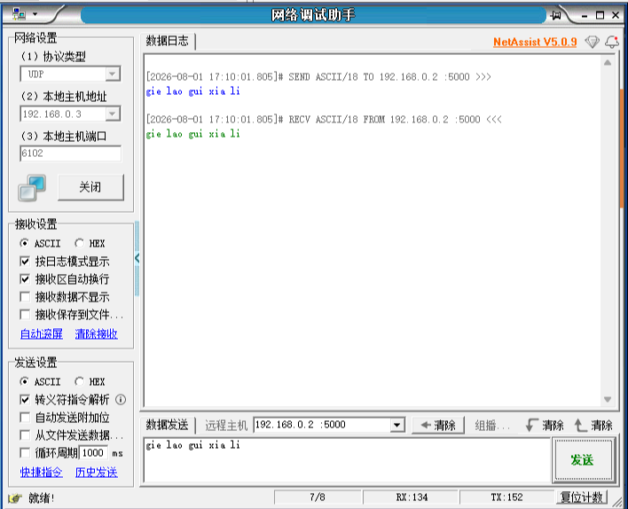

# GMII_UDP_lookback

该项目实现以太网 UDP GMII 回环。

代码借鉴于小梅哥。使用前建议先阅读项目中的 PDF 文档，将电脑绑定到对应的 IP；另一个工具是用于发送数据包并进行回环测试的上位机。

具体用法可以去看 B 站上小梅哥的视频。

## 遇见的问题！！！

感觉代码完全没有毛病，IP 也正确设置了，但是却回环失败了，我懵逼了。

更懵逼的是，同样的程序，我都没改，前后下载居然一个能成功实现回环，一个不能成功。试了好多次，只成功了一次，也不知道是电脑的问题还是板卡的问题。

## 测试截图

